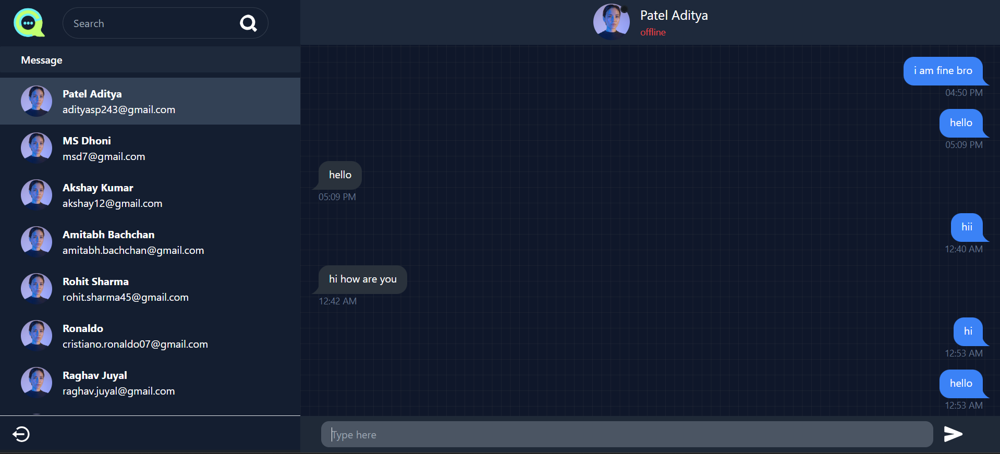
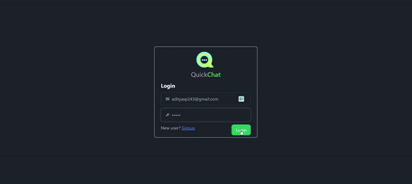

# QuickChat

QuickChat is a real-time chat application built using modern web technologies. It provides a simple, intuitive interface for users to chat with each other in real time. The app features user authentication, secure messaging, and responsive design for both desktop and mobile users.

  
_QuickChat interface on desktop and mobile_

**[Live Demo](https://quickchat-aditya.onrender.com)**

---

1. **Project GIF**:

     
    

2. **Deployed Link**:
  
     **[Live Demo](https://quickchat-aditya.onrender.com/)**

## Features

- **User Authentication**: Secure user signup and login using JWT tokens and cookies.
- **Real-Time Messaging**: Chat with other users in real-time using WebSockets.
- **Responsive Design**: Optimized for both desktop and mobile, providing a seamless user experience.
- **Protected Routes**: Only logged-in users can access certain routes.
- **Media Support**: Users can send images and other media files.
- **Notifications**: Get notified when a new message arrives.
  
## Tech Stack

- **Frontend**:
  - React.js (with Vite)
  - Zustand for state management
  - Axios for API calls
  - DaisyUI for styling
  - Vite for fast builds and development
  - React Router for navigation

- **Backend**:
  - Node.js with Express.js
  - MongoDB with Mongoose for database management
  - Socket.IO for real-time communication
  - JWT for user authentication
  - Cookie-Parser for handling cookies

- **Deployment**:
  - Hosted on Render

## Getting Started

### Prerequisites

Ensure you have the following installed:

- [Node.js](https://nodejs.org/) (version 16 or higher recommended)
- [MongoDB](https://www.mongodb.com/)

### Installation

1. **Clone the repository**:
   ```bash
   git clone https://github.com/Aditya-Patel24/QuickChat.git
   cd QuickChat
   ```

2. **Set up environment variables**:
   Create a `.env` file in the root directory and add the following variables:
   ```bash
   MONGODB_URI=your_mongodb_uri
   PORT=4002
   JWT_SECRET=your_jwt_secret
   ```

3. **Install dependencies**:

   For the backend:
   ```bash
   npm install
   ```

   For the frontend:
   ```bash
   cd frontend
   npm install
   ```

4. **Run the application**:

   - To run the backend:
     ```bash
     npm run dev
     ```

   - To run the frontend:
     ```bash
     cd frontend
     npm run dev
     ```

5. **Access the app**:

   Open your browser and navigate to `http://localhost:3001` (or the deployed URL).

### Deployment

The app is deployed on Render. Make sure you have the correct environment variables configured in your Render settings.

```bash
https://quickchat-aditya.onrender.com
```

## Folder Structure

```bash
QuickChat/
│
├── backend/
│   ├── controller/         # Contains all controller logic
│   ├── middleware/         # Middleware for secure routes
│   ├── models/             # Mongoose models for MongoDB
│   ├── routes/             # API routes for users and messages
│   └── socketIO/           # WebSocket logic for real-time communication
│
├── frontend/
│   ├── src/
│   │   ├── assets/         # Static assets like images and audio files
│   │   ├── components/     # Reusable UI components
│   │   ├── context/        # Context API and Zustand state management
│   │   ├── hooks/          # Custom React hooks
│   │   └── pages/          # Main page components (Login, Signup, Chat, etc.)
│   ├── dist/               # Production build of the frontend
│
├── .env                    # Environment variables
├── package.json            # Backend dependencies and scripts
└── README.md               # Project documentation
```

## API Endpoints

### User Authentication

- **POST** `/api/user/signup` – Register a new user.
- **POST** `/api/user/login` – Log in an existing user.
- **POST** `/api/user/logout` – Log out the current user.

### Messages

- **GET** `/api/message` – Get all messages from a conversation.
- **POST** `/api/message` – Send a new message.

### Real-time Communication

- Uses Socket.IO for sending and receiving messages in real-time.

## Issues and Troubleshooting

- **404 Errors**: Ensure your backend routes are set up correctly and that the frontend is making requests to the correct API endpoints.
- **CORS Issues**: Ensure your `cors` configuration is correct and that credentials are allowed for cross-origin requests.
- **WebSocket Connection Issues**: Check if the WebSocket server is running correctly and listening on the same port as the server.

## Future Improvements

- Add typing indicators and read receipts.
- Implement group chat functionality.
- Add user profile management.
- Enable message encryption for better privacy.
